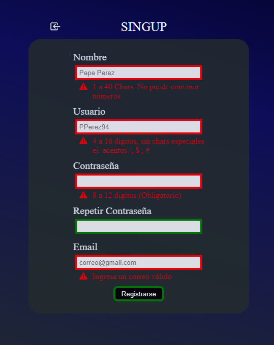

# SingUP

## Trabajo/practica → Regex

Deberas realizar una la simulacion de una web de registro. La cual el formulario de registro debe contener validación de los campos según corresponda.

- **************Nombre →************** Debe validar nombre completo del usuario (no puede contener caracteres especiales o numeros)
- ********************Usuario →******************** Debe contener al menos 4 caracteres, puede contener numeros y/o guion medio o guion bajo.
- **********Password →********** Debe contener al menor 8 caracteres (no tiene limitacion de caracteres especiales o numeros)
- ************Email →************ Puede contener letras, numeros , `-`, `_` . debe contener un @, un `.`  y extension de dominio de 3 caracteres ( .com .org .net)

Ejemplo:

